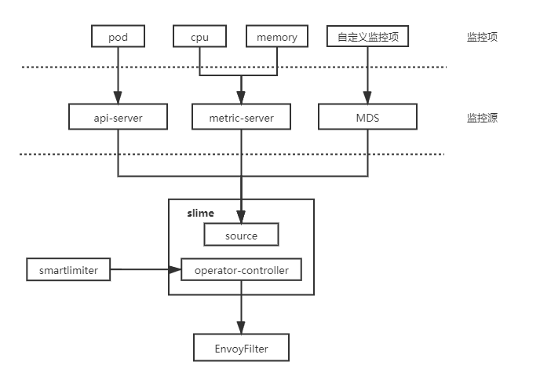

## 自适应限流

随着mixer的移除，要实现服务网格中的限流变得非常复杂。全局限流需要配置额外部署 RLS (Ratelimit Server)，即使是本地限流也需要借助envoy内建插件-- envoy.local.ratelimit，为此使用者不得不再次面对复杂的EnvoyFilter配置。相较于二代微服务框架中成熟的限流组件而言，envoy的本地限流组件功能也略显简单，例如，无法做到自适应限流，只能以实例维度配置限流值等。

为了解决istio中服务限流的短板，我们设计了自适应限流模块，同时在易用性方面，我们也设计了一套新的API -- SmartLimiter。其主体架构分为两部分，一部分为SmartLimiter到EnvoyFilter的转换逻辑，另一部分为监控数据获取。目前slime支持从K8S metric获取服务的CPU，Memory，副本数等数据，当然我们也对外提供了一套监控数据对接接口（Metric Discovery Server），通过MDS，可以将自定义的监控指标同步给限流组件。



SmartLimiter的配置是比较接近自然语义的，例如希望在CPU超过80%时触发服务A的访问限制，限额为30qps，对应的SmartLimiter定义如下：

```yaml
apiVersion: microservice.netease.com/v1alpha1
kind: SmartLimiter
metadata:
  name: a
  namespace: default
spec:
  descriptors:
  - action:
      fill_interval:
        seconds: 1
      quota: "30/{pod}"    # 30为该服务的额度，将其均分给每个pod
    condition: "{cpu}>0.8" # 根据监控项{cpu}的值自动填充该模板

```

最终产生的限流行为，如下图所示：


